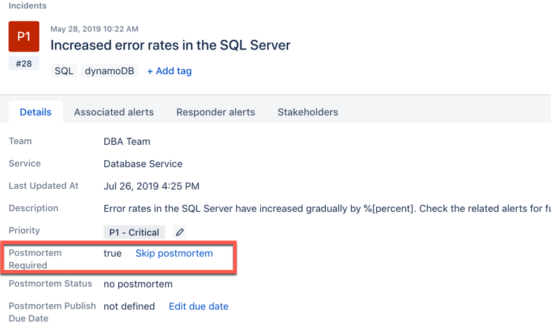
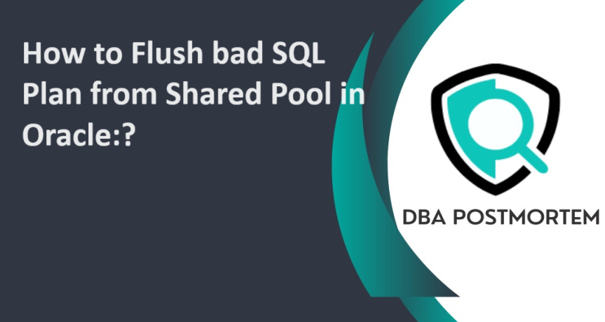

# Postmortem: API Service Outage on SpiceShare Platform
The README for the 0x19-postmortem project. Postmortem on the service outage observerd on the API service
for SpiceShare web app.

## Issue Summary
On 15th August, 2024, a service outage occured. The outage lasted for 2 hours, from 14:00 to 16:00 GMT.
* Impact: The API service responsible for serving recipe data became unresponsive, leading to a 50% decrease in successful requests. Approximately 75% of users experienced slow response times, while 25% faced complete service outages. Users were unable to retrieve or upload recipes during this period.
* Root Cause: The outage was caused by an unoptimized database query that led to a bottleneck, overwhelming the database server and causing timeouts.

## Timeline
* _14:00 GMT_: Monitoring systems detected a significant increase in API response times.
* _14:05 GMT_: An alert was triggered, and the on-call engineer was notified of the issue.
* _14:10 GMT_: Initial investigation began, focusing on API server performance, assuming it was related to recent code deployments.
* _14:20 GMT_: The issue was escalated to the database team after the API server logs showed multiple query timeouts.
* _14:30 GMT_: The database team identified that a specific query was taking too long to execute due to a missing index.
* _15:00 GMT_: The database team applied a hotfix by adding the necessary index to the database.
* _15:30 GMT_: Monitoring confirmed that API response times returned to normal.
* _16:00 GMT_: The incident was declared resolved after a period of observation.

## Root Cause and resolution
The root cause of the outage was an unoptimized SQL query within the API service that lacked proper indexing on a frequently accessed table. This led to the database server being overwhelmed, causing queries to time out and the API service to become unresponsive.

The issue was resolved by identifying the problematic query and applying an index to the relevant database table. This optimization reduced query execution time from several seconds to milliseconds, restoring the API service's normal operation.

## Corrective and preventative measures
* Improvements: The incident highlighted the need for better database query optimization practices and more comprehensive monitoring of database performance.

* Action Items:
	1. __Implement Database Query Review Process__: Regularly review and optimize SQL queries before deployment.
	2. __Expand Monitoring__: Add detailed database performance monitoring to track slow queries and potential bottlenecks.
	3. __Patch Database Server__: Apply the latest updates and patches to the database server to ensure optimal performance.
	4. __Postmortem Review__: Conduct a review meeting to discuss the incident and refine incident response procedures.

_Image from https://www.dbapostmortem.com_
